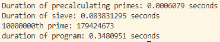

# prime_finder
A short program in rust that i wrote to find the 10 millionth prime using rayon.
While it is parallelized, it runs on the CPU, so getting the 10 millionth prime might take a second, especially with less cores.

## The algorithm
* Approximate upper limit of sieve, to make sure the 10 millionth prime is included in that range.
* Calculate all primes up to the square root of that upper limit, using a simple O(n^1.5) algorithm.
* Make a buffer with booleans the size of the upper limit ( known as a sieve ).
* Go through each element and mark all multiples of the precalculated primes as non-prime.
* Collect the resulting indices of the buffer at which the value is true.
* Print the 10 millionth item in that collection.

### sample output
